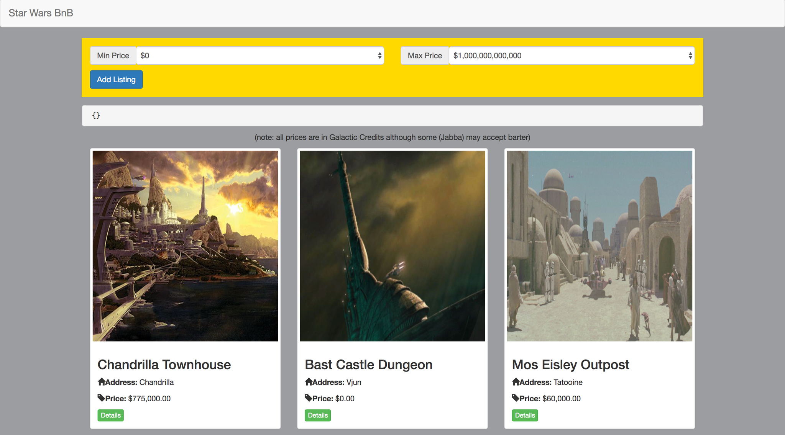

# StarWars BnB

## Installation
####In Browser
for quick access to the app visit this <a href="https://ericbezanson.github.io/StarWarsBnB/">Link</a>
####Local
To run the app locally you will need to use a local server, I suggest installing <a href="https://www.mamp.info/en/">MAMP</a> and while in the console navigate to the htdocs folder within MAMP and run: <pre>git clone https://github.com/ericbezanson/StarWarsBnB.git</pre>
######(note: MAMP is just a personal suggestion, any local server will do)

##Functionality
A long long time ago, In a galaxy far far away... it was not always easy to find a place to stay. Wherever you are in the galaxy, which ever side of the conflict you align with, StarWars BnB is here to help! We have a bunch of listings accross the galaxy providing accomedations no matter what budget you have! Simply browse the page and if something catches your eye be sure to click on the details button for more information, You can even filter by a custom price range.

##How it Works

the Data for the accomedations is stored locally in a data.json file. The cribsFactory.js service then grabs that data via http.get request inside an angular factory. That service is injected to the dependancy array of the CribsController and then fed to the index.html file which lays out the page.

A custom angular filter returns an array of filtered listings. By default it will display listing between 0 and 1000000000000 Galactic credits. It does this by creating an empty listing array and min/max price variables. Using the built in angular helper method forEach it will iterate over listings past in. Each listing that falls within the min and max price it will be pushed to the array and be dynamically displayed on the page. 

